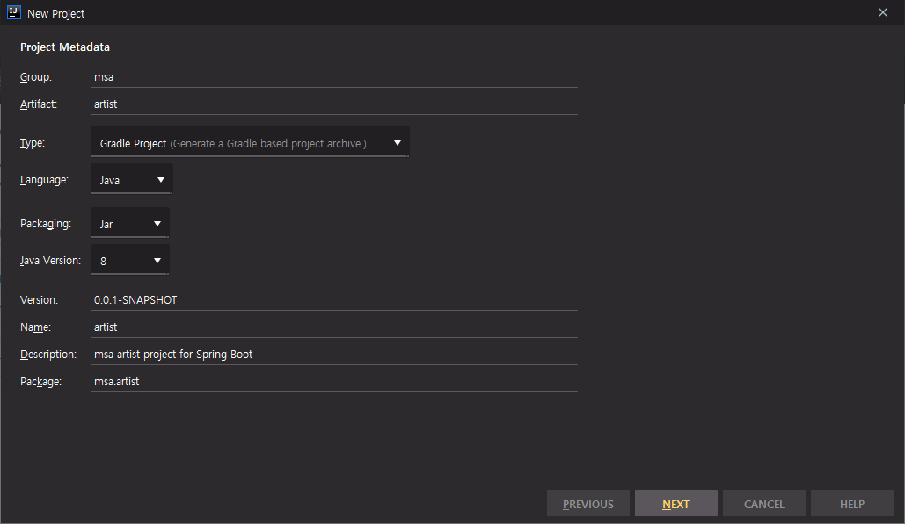

# springboot-msa-demo


## Spring Boot 프로젝트 생성





## User DB 생성

```bash
$ docker run -p 8101:27017 --name user -d mongo
$ docker exec -it user bash
root@33ef515645b2:/# mongo
```


```sql
> use user
> db.user.insertMany([
    {
        "userId" : "123",
        "name" : "alpha"
	},
    {
        "userId" : "124",
        "name" : "beta"
	}
]);
```


## Support DB 생성

```bash
$ docker run -p 8105:27017 --name support -d mongo
$ docker exec -it support bash
root@e6288e46e915:/# mongo
```


```sql
> use support
> db.support.insertMany([
    {
        "userId" : "123",
        "artistId" : "6",
        "amount" : "500",
        "datetime" : "2020-05-22 00:00:00",
        "uid" : "artist_6_1590109842492"
    },
    {
        "userId" : "123",
        "artistId" : "5",
        "amount" : "100",
        "datetime" : "2020-04-27 20:21:37",
        "uid" : "artist_3_1590109842492"
    },
    {
        "userId" : "124",
        "artistId" : "3",
        "amount" : "1000",
        "datetime" : "2020-04-30 20:21:37",
        "uid" : "artist_3_1590109842567"
    },
    {
        "userId" : "123",
        "artistId" : "3",
        "amount" : "10000",
        "datetime" : "2020-05-30 22:20:32",
        "uid" : "artist_3_1590109384757"
    }
]);
```


## Artist DB 생성

```bash
$ docker run -p 8102:27017 --name artist -d mongo
$ docker exec -it artist bash
root@e6288e46e915:/# mongo
```


```sql
> use artist
> db.artist.insertMany([
    {
    	"artistId" : "3",
    	"artistName" : "태연 (TAEYEON)"
    },
    {
    	"artistId" : "5",
    	"artistName" : "레드벨벳 (Red Velvet)"
    },
    {
    	"artistId" : "6",
    	"artistName" : "청하"
    }
]);
```


## User, Support 서버 실행

intelliJ로 각각의 프로젝트를 Open => Run


## 결과 확인

### User

http://localhost:8002/api/user/

```json
[
  {
    "id": "5ede695017789bfbdba321bf",
    "userId": "123",
    "name": "alpha"
  },
  {
    "id": "5ede695017789bfbdba321c0",
    "userId": "124",
    "name": "beta"
  }
]
```


http://localhost:8002/api/user/123

```json
{
  "id": "5ede695017789bfbdba321bf",
  "userId": "123",
  "name": "alpha"
}
```


### Support

http://localhost:8005/api/support/

```json
[
  {
    "artistName": "청하",
    "userName": "alpha",
    "amount": 500,
    "datetime": "2020-05-22 00:00:00"
  },
  {
    "artistName": "레드벨벳 (Red Velvet)",
    "userName": "alpha",
    "amount": 100,
    "datetime": "2020-04-27 20:21:37"
  },
  {
    "artistName": "태연 (TAEYEON)",
    "userName": "beta",
    "amount": 1000,
    "datetime": "2020-04-30 20:21:37"
  },
  {
    "artistName": "태연 (TAEYEON)",
    "userName": "alpha",
    "amount": 10000,
    "datetime": "2020-05-30 22:20:32"
  }
]
```


http://localhost:8005/api/support/user/123

```json
[
  {
    "artistName": "청하",
    "userName": "alpha",
    "amount": 500,
    "datetime": "2020-05-22 00:00:00"
  },
  {
    "artistName": "레드벨벳 (Red Velvet)",
    "userName": "alpha",
    "amount": 100,
    "datetime": "2020-04-27 20:21:37"
  },
  {
    "artistName": "태연 (TAEYEON)",
    "userName": "alpha",
    "amount": 10000,
    "datetime": "2020-05-30 22:20:32"
  }
]
```


### Artist

http://localhost:8003/api/artist/

```json
[
  {
    "id": "5ede63fce7253224f32986f9",
    "artistId": "3",
    "artistName": "태연 (TAEYEON)"
  },
  {
    "id": "5ede63fce7253224f32986fa",
    "artistId": "5",
    "artistName": "레드벨벳 (Red Velvet)"
  },
  {
    "id": "5ede63fce7253224f32986fb",
    "artistId": "6",
    "artistName": "청하"
  }
]
```


http://localhost:8003/api/artist/3

```json
{
  "id": "5ede63fce7253224f32986f9",
  "artistId": "3",
  "artistName": "태연 (TAEYEON)"
}
```

